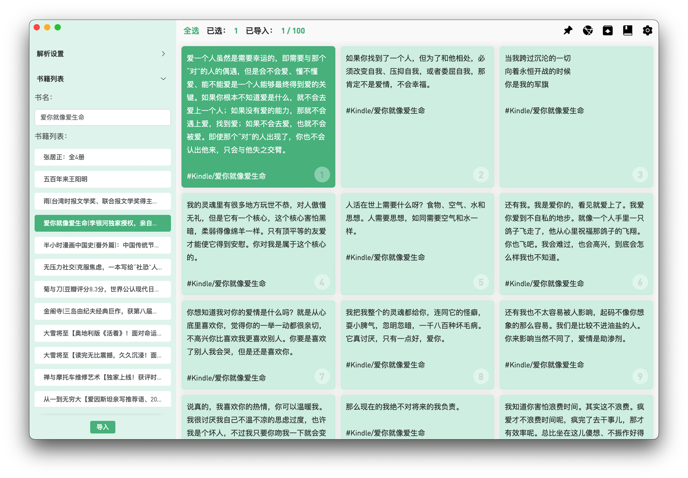
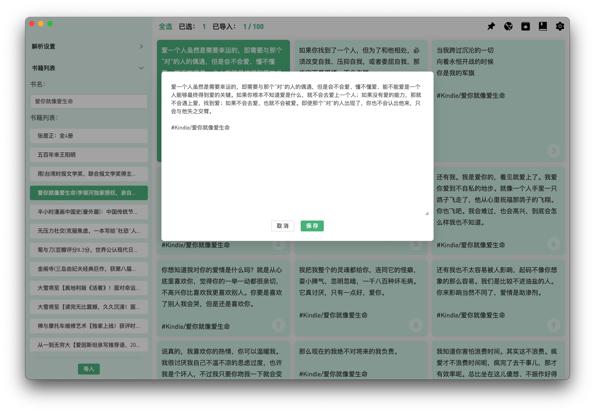
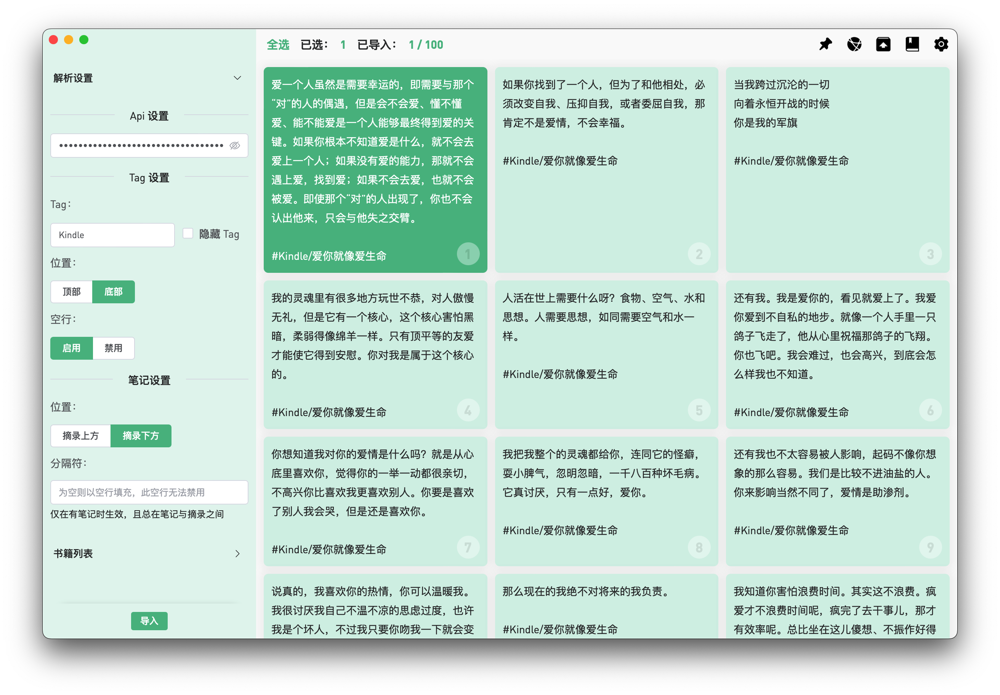
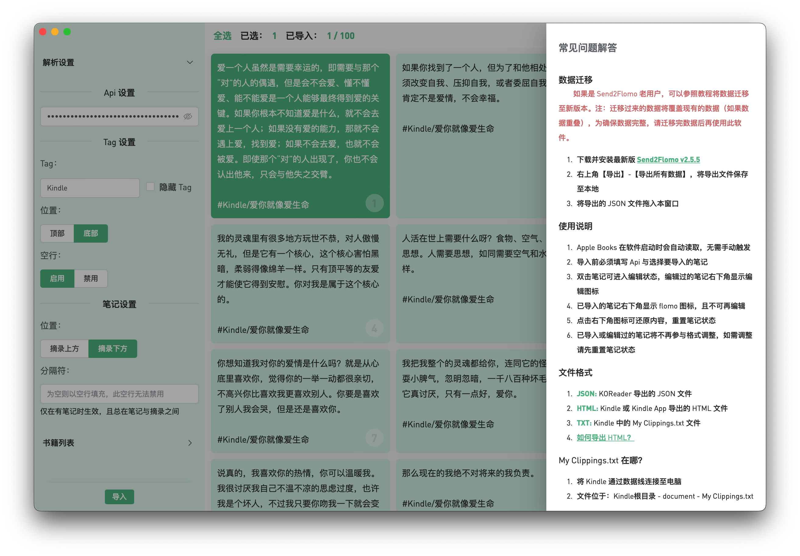

# Send2flomo
> 将 Kindle、Apple Books、KOReader、微信读书笔记一键导入至 flomo

&nbsp;&nbsp;

&nbsp;&nbsp;

&nbsp;&nbsp;

&nbsp;&nbsp;

## 📦 Downloads
[📝 Update Log](./UPDATE_LOG.md)

### [网盘下载](https://wwyh.lanzoue.com/b02e0ddbe) 访问密码：g1ce
### [GitHub Releases](https://github.com/Tit1e/SendToflomo/releases)

## 🌍 网页版（不支持 Apple Books）
### [SendToflomo](https://tit1e.github.io/kindle2Flomo/)
### [Send2Flomo(旧版)](https://tit1e.github.io/kindle2Flomo/old/)

## 📋 注意事项
* 将文件拖入应用界面即可导入
* 微信读书笔记导入方式为【登录网页端】-【复制全部笔记】-【使用粘贴快捷键 CtrlOrCmd + v】，注意，粘贴时光标不要定位在输入框内
* 旧数据迁移会覆盖现有数据（如果存在相同记录），因此尽量迁移完成后再进行导入
* Apple Books 数据在软件启动时会自动读取，因此【清除所有数据】后，依旧会有 Apple Books 的数据，不过此时的数据已被重置。

## 👀 预览

## 注册
### [flomo](https://flomoapp.com/register2/?MTAzNDE)

## 问题反馈

