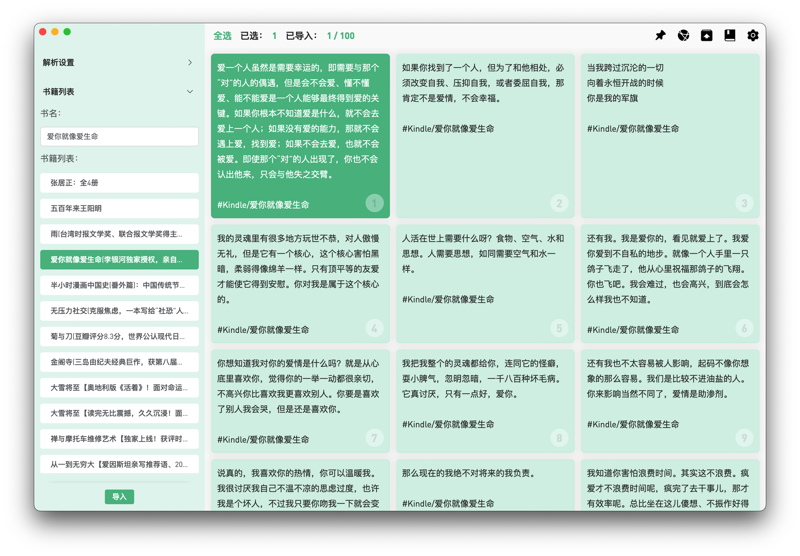
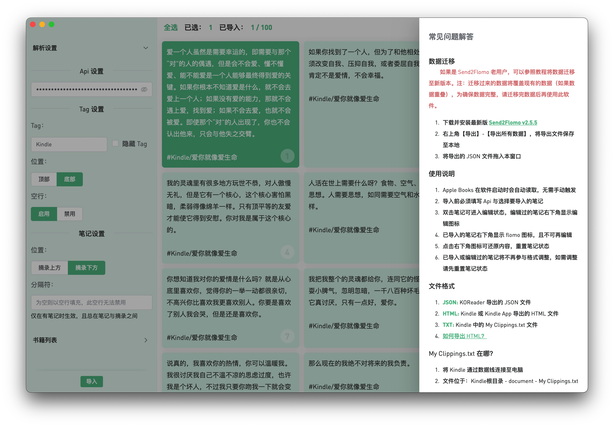

# SendToflomo
> Import Kindle, Apple Books, KOReader notes to flomo

## 📦 Downloads
[📝 Update Log](./UPDATE_LOG.md)

### [Netdisc](https://wwyh.lanzoue.com/b02e0ddbe) Password: g1ce
### [GitHub Releases](https://github.com/Tit1e/SendToflomo/releases)

## 🌍 Use Online (Apple Books not supported)
### [SendToflomo](https://tit1e.github.io/kindle2Flomo/)
### [Send2Flomo(old version)](https://tit1e.github.io/kindle2Flomo/old/)

## 📋 Remind
* The import method is to drag files into the application
* Old data migration will cover the existing data (if there is the same record), so try to move as much as possible before importing
* Apple Books data will be read automatically when the software starts, so after [Clear All Data], there will still be Apple Books data, but the data has been reset

## 👀 Preview

## Register
### [flomo](https://flomoapp.com/register2/?MTAzNDE)

## Feedback

